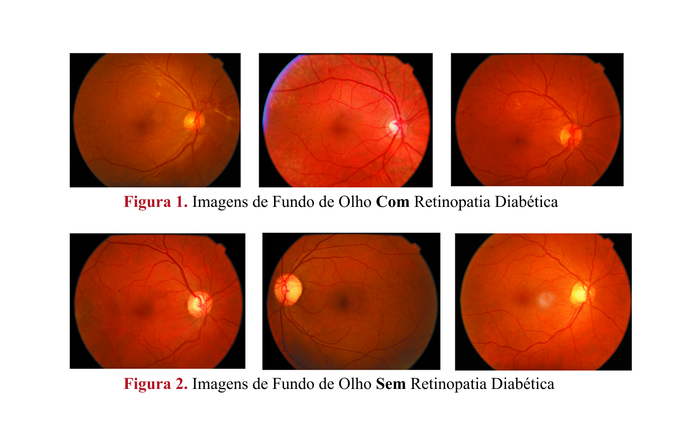
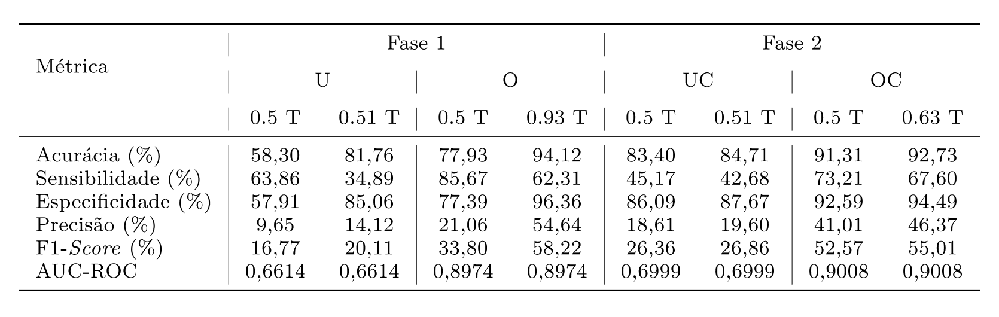

# 🧠 Avaliação de Estratégias para Classes Desbalanceadas

Este projeto avalia técnicas de **undersampling** e **oversampling** no treinamento de uma CNN simples, aplicada ao dataset BRSET, com imagens de fundo de olho, que possui apenas **6,58%** de casos positivos para retinopatia diabética. Esse foi o estudo inicial da minha iniciação científica em uso de redes neurais convolucionais na identificação de doenças oculares por imagens de fundo de olho.

## 🔍 Problema
Investigar como diferentes estratégias de balanceamento afetam sensibilidade, precisão e AUC na detecção de retinopatia diabética do dataset BRSET. Alguns exemplos das imagens utilizadas são: 

## 🛠️ Tecnologia
As tecnologias empregadas foram:
- Python  
- TensorFlow / Keras  
- Scikit-Learn  
- Pandas / NumPy  
- Google Colab  

## 🧱 Arquitetura
A arquitetura da rede neural utilizada não conta com pré treinamento:

## ⚙️ Estratégias Avaliadas
- **Fase 1:** undersampling e oversampling aleatório  
- **Fase 2:** técnicas com clusterização para preservar padrões no over e no under sampling
Em ambas as fases, foi realizado ajuste de thsould.

## 📊 Resultados 
Favorecer a classe minoritária revelou-se mais vantajoso do que reduzir a classe majoritária (os valores do oversampling, tanto com e sem clusterização se mostraram melhores), e o treino com AUC-ROC e clusterização deixou os valores mais balanceados sem necessitar da alteração do threshold. Os resultados foram:

